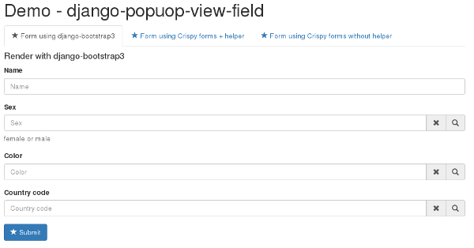
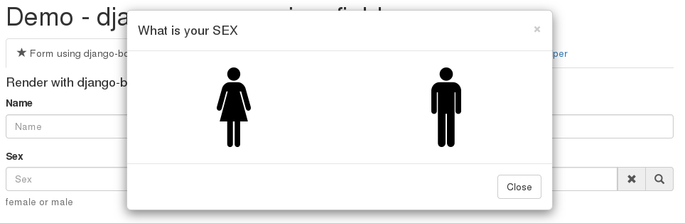
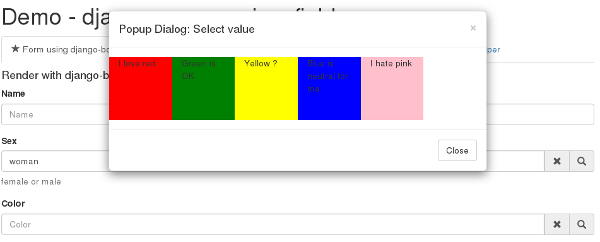

# django-popup-view-field
Field and widget can render bootstrap dialog window with content from django view.
You can create normal djagno View and load this view in dialog for form field.

- Support for :

    * Python: 2.7, 3.4
    * Django: 1.8, 1.9, 1.10
    * django-crispy-forms
    * django-bootstrap3

- Require:

    * Django
    * django-bootstrap3 or django-crispy-forms
    * bootstrap3
    * JQuery

- Supported locale:

    * EN - (english)
    * PL - (polish)

- Tested on browsers:

    * OK - Firefox 50.1.0 - Ubuntu 14.04
    * OK - Firefox 31.1 - CentOS 6.4
    * OK - Chromium 53.0 - Ubuntu 14.04
    * OK - Microsoft Edge 38 - Windows 10
    * OK - Internet Explorer 11.0 - Windows 10
    * OK - Internet Explorer 10.0 - Windows 7
    * OK - Internet Explorer 9.0 - Windows 7
    * ER - Internet Explorer <= 8 (no support "html()" for data-popup-view-value in popups)

Screenshots
------------

- Example: Form with django-popup-view-fieds

- Example: Dialog for select sex

- Example: Dialog for select color

- Example: Dialog with form

.. image:: doc/static/scr4.png
    :alt: Dialog with form

Run demo
---------
1. Clone or download repository:

    git clone https://github.com/djk2/django-popup-view-field.git

2. Create your virtualenv (red more: http://docs.python-guide.org/en/latest/dev/virtualenvs/):

3. Install requirements for demo:

    cd django-popup-view-field/demo

    pip install -r requirements.txt

4. Run django developing web server:

    python manage.py runserver

5. Run your browser with url: 127.0.0.1:8000

    firefox 127.0.0.1:8000

Warnig
------
**Project is not finished yet. The first full version will be available after 25 December 2016**
Currently application works fine but I must write documentation.
If you realy wont use this code, please see demo and evrything will be clear.
